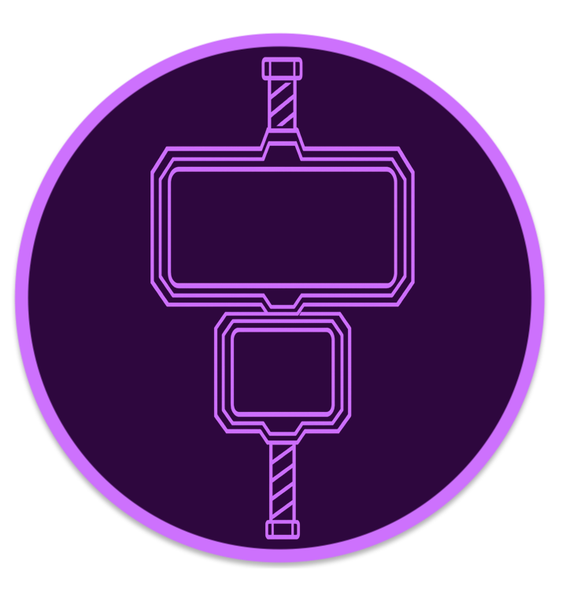

# Magni – Privacy‑first Dual‑Screen Web Browser for AYN Thor

[](https://github.com/KuriGohan-Kamehameha/magni/actions)
[](https://github.com/KuriGohan-Kamehameha/magni/releases)
[](LICENSE)
[](https://github.com/ImranR98/Obtainium)

<p align="left"></p>

Magni is a lightweight, open‑source Android web browser built around the dual‑screen
AYN Thor handheld. It recreates the nostalgic Nintendo DSi/3DS browsing experience while
living up to modern privacy and security expectations. When a second display isn’t
available it automatically falls back to a fully usable single‑screen layout.

## Table of Contents
1. [Features](#features)
2. [Requirements](#requirements)
3. [Installation](#installation)
4. [Configuration](#configuration)
5. [Usage](#usage)
6. [Project Structure](#project-structure)
7. [Technical Details](#technical-details)
8. [Privacy Notes](#privacy-notes)
9. [Architecture](#architecture)
10. [Contributing](#contributing)
11. [License](#license)
12. [Acknowledgments](#acknowledgments)

## Features

### Dual‑Screen Experience
- Top screen shows a full‑page overview mini‑map with an interactive viewport rectangle.
- Bottom screen hosts a fully interactive WebView; pinch or hardware keys control zoom.
- Real‑time synchronization – dragging or pinching on either screen pans/zooms both.
- Secondary display detection via `ActivityOptions.setLaunchDisplayId`; automatically
  falls back to single‑screen.

### Retro‑Inspired Controls & Themes
- Hardware keys mapped to **BACK**, **FORWARD**, **RELOAD**, **URL**, **HOME**, zoom in/out.
- Long‑press URL key copies current address to clipboard.
- Custom start page with user‑selectable themes.
- Includes **DSi Classic** preset for authentic Nintendo DSi color scheme.

### Privacy & Security First
- HTTPS‑only by default; cleartext blocked with network security config.
- Third‑party tracker domains blocked at request time.
- Fine‑grained cookie controls (allow first‑party, block third‑party, or block all).
- Optional private (incognito) mode with automatic cleanup.
- Geolocation, camera/microphone, and other sensitive permissions denied by default.
- `FLAG_SECURE` prevents screenshots/recordings at the OS level.
- Anti‑abuse protections: JS spam throttling, download rate limiting, popup blocking,
  and render‑process crash recovery.

### Browsing Essentials
- Bookmark and history management with search/clear functions.
- Downloads with privacy‑respecting defaults and throttling.
- Simple URL/home navigation and customizable home page.
- Responsive behaviour on both single‑ and dual‑screen devices.

### Developer & Power‑User Features
- Kotlin codebase targeting AndroidX; minimal third‑party dependencies.
- ProGuard minification in release builds for privacy logic and size reduction.
- GitHub Actions CI for building and publishing releases.
- Small APK footprint; a mere ~4MB download! Magni is one-third the size of a typical Chrome .apk file.
- Zero telemetry or analytics.

## Requirements

- Android **8.0 (API 26)** or higher (target API 35).
- Java **17+** (bundled with Android Studio).
- Gradle **8.0+** (wrapper included).
- AYN Thor dual‑screen hardware recommended; single screen support is built in.

## Installation

### 🚀 Via Obtainium (Recommended)

1. Install [Obtainium](https://github.com/ImranR98/Obtainium) on your device.
2. Open Obtainium and tap **Add App**.
3. Enter the repository URL:
   ```
   https://github.com/KuriGohan-Kamehameha/magni
   ```
4. Tap **Add** — Obtainium will fetch the latest APK and install it.
5. In Obtainium app settings for Magni, set APK filter regex to:
   ```
   .*release\.apk$
   ```
   This ensures Obtainium installs the stripped release asset instead of debug builds.
6. Updates are automatically detected when new GitHub releases are published.

### 🛠 Building from Source

```bash
git clone https://github.com/KuriGohan-Kamehameha/magni.git
cd magni
# open the directory in Android Studio and let Gradle sync

# debug build + install
./gradlew :app:assembleDebug :app:installDebug

# release APK (minified)
./gradlew :app:assembleRelease
```

Releases are also available on the [GitHub Releases page](https://github.com/KuriGohan-Kamehameha/magni/releases).

## Configuration

Set your Android SDK location in `local.properties`:

```properties
sdk.dir=/path/to/android/sdk
```

Additional settings can be adjusted in `gradle.properties` or via Android Studio.

## Usage

### Basic Browsing
1. Interact with the webpage on the bottom screen.
2. Drag or pinch on the top mini‑map to move the viewport.
3. Use hardware keys or on‑screen controls for navigation and zoom.

### Zoom & Viewport
- Use `-`/`+` buttons or pinch to adjust magnification.
- The viewport box on the mini‑map resizes accordingly.

### Settings
- Choose between themes or enable the DSi preset.
- Toggle privacy options (cookies, private mode).
- Clear or search history/bookmarks.
- Configure start page and HOME button behaviour.

## Project Structure

```
app/src/main/
├── java/com/ayn/magni/
│   ├── OverviewActivity.kt       # Top-screen map
│   ├── ZoomActivity.kt           # Bottom-screen WebView
│   ├── ui/OverviewMapView.kt     # Custom view
│   ├── settings/                 # Settings UI and helpers
│   └── sync/BrowserSyncBus.kt    # Screen synchronization
├── res/
│   ├── values/strings.xml        # UI text
│   ├── values/colors.xml         # Theme palettes
│   └── xml/network_security_config.xml # HTTPS/network policies
└── AndroidManifest.xml
```

## Technical Details

- **Language**: Kotlin + AndroidX.
- **Min SDK**: 26; **Target SDK**: 35.
- Uses `WebView.capturePicture()` (deprecated but reliable) for overview snapshots.
- Secondary-display support via `ActivityOptions.setLaunchDisplayId`.
- ProGuard/minify enabled for release builds.

## Privacy Notes

Magni is built with privacy at its core:

- No telemetry, analytics, or tracking.
- All network requests are encrypted (HTTPS‑only).
- Cookies are opt‑in and third‑party trackers are blocked.
- Code is fully open source for auditability.

## Architecture

- **OverviewActivity** – manages the top-screen mini-map and listens for viewport
  changes.
- **ZoomActivity** – hosts the WebView, handles gestures, and broadcasts state changes.
- **BrowserSyncBus** – lightweight event bus (LiveData/Flow) for cross-activity sync.
- **OverviewMapView** – custom Canvas view drawing full-page bitmap and viewport box.

## Contributing

Contributions are welcome! Please read [CONTRIBUTING.md](CONTRIBUTING.md) before
submitting issues or pull requests. Run `./gradlew build` and consult `RELEASE_CHECKLIST.md`
prior to release-related commits.

## License

MIT © 2026

- **fitoori** (https://github.com/fitoori)
- **kurigohan-kamehameha** (https://github.com/kurigohan-kamehameha)

Original development and maintenance by the above contributors. See the [LICENSE](LICENSE) file for full details.

## Acknowledgments

- Nintendo DSi/3DS browser for inspiration.
- AYN Thor dual-screen hardware.
- Android WebView and AndroidX teams.
- Copilot


